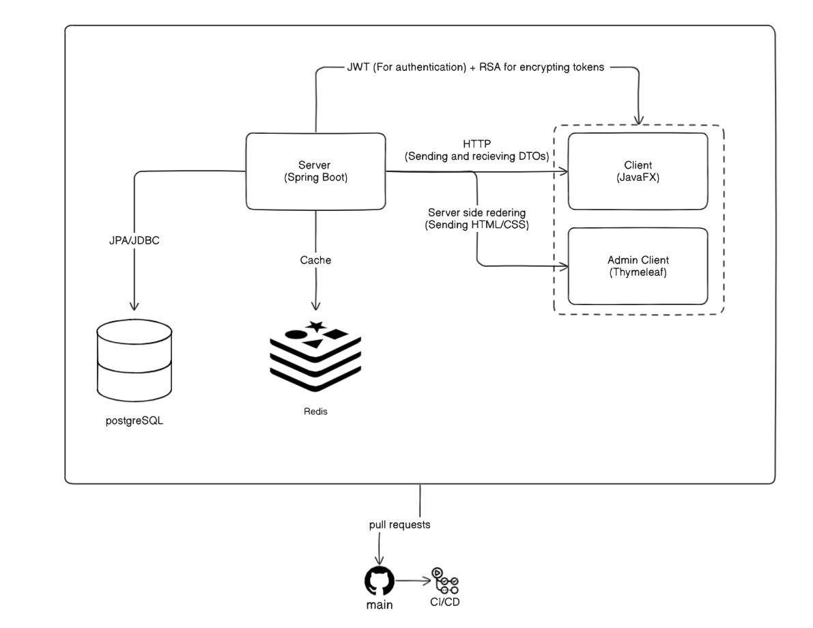

# SkyBooker


## Execution
Ce projet s'exécute en deux étapes. pour exécuter le serveur, vous devez avoir Docker installé sur votre machine. Si tel est le cas, vous pouvez exécuter le serveur en exécutant la commande suivante à partir du répertoire `serveur`
```bash
docker compose up
```
pour exécuter le client, vous exécutez les commandes suivantes dans le répertoire `client`
```bash
./mvnw javafx:run
```
Notez que le client ne peut pas fonctionner correctement sans que le serveur ne soit en cours d'exécution

## The architecture
This application uses server-client architecture, where the server is created using [the spring framework](https://spring.io/projects/spring-framework) and the client is created using [JavaFX](https://openjfx.io/). We also use [Redis](https://redis.io/) for caching




## Database
This is the current schema of the database


## Admin Panel

The Admin Panel provides a dedicated interface for managing the airline's data, including flights, passengers, reservations, and core entities like airports, aircraft, etc. It also includes a Dashboard for visualizing key operational statistics.

### Accessing the Admin Panel

To access the Admin Panel, navigate to the base admin URL in your browser: http://localhost:8080/admin

### Login

When you attempt to access any page under the `/admin/**` path (including the base `/admin` URL) without being authenticated, the system will automatically redirect you to the Admin Login page.

The login page is located at: http://localhost:8080/admin/login

Here is a screenshot of the Admin Login page:


To log in, you will need valid administrator credentials. Ensure you have a user account with the necessary `ROLE_ADMIN` authority configured in the system. Enter your email and password in the form provided.

### Navigation

Once logged in, the header navigation bar provides links to the main sections:

* **Admin Panel:** ([`/admin`](http://localhost:8080/admin)) - This is the default landing page and contains cards (buttons) linking to all the individual entity management pages (Flights, Passengers, Reservations, Airports, etc.) and detailed statistics reports.

  Here is a screenshot of the Admin Panel page:

  

* **Dashboard:** ([`/admin/dashboard`](http://localhost:8080/admin/dashboard)) - This page focuses on data visualization, displaying key operational statistics through charts.

  Here is a screenshot of the Dashboard page:

  

* **Management Page:** (For example : [`/admin/avion`](http://localhost:8080/admin/avion)) - This page allows you to add, edit, and delete entries for the `avion` entity.
    
    Here is a screenshot of Avoin Managenemt page:

  

The header also includes direct links to all entity management lists and individual statistics reports for quick access.

### Logout

To securely log out of the Admin Panel, click the "Logout" button located in the header navigation bar. This will end your session and redirect you back to the login page.

